# jsonld-signatures-bbs-spec

BBS+ is a pairing-based cryptographic signature used for signing 1 or more messages. As described in the [BBS+ spec](https://eprint.iacr.org/2016/663.pdf),
BBS+ keys function in the following way:

1. A a prime field &integers;p
1. A bilinear pairing-friendly curve `E` with three groups &#x1D53E;1, &#x1D53E;2, &#x1D53E;T of prime order `p`.
1. A type-3 pairing function `e` such that `e : ` &#x1D53E;1 `X` &#x1D53E; &xrarr; &#x1D53E;T.  More requirements for this can be found in section 4.1 in the [BBS+ spec](https://eprint.iacr.org/2016/663.pdf)
1. A base generator 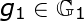 for curve `E`
1. A base generator 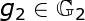 for curve `E`
1. *L* messages to be signed
1. **Key Generation**
    1. Inputs 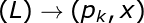
    1. Generate a random generator for each message 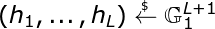
    1. Generate a random generator used for blinding factors 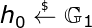
    1. Generate random 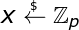
    1. Compute 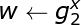
    1. Secret key is `x` and public `pk` is 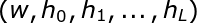)
    1. Output (`pk`, `x`)
1. **Signature**
    1. Inputs 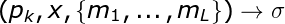
    1. Each message is converted to be integers 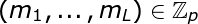
    1. Generate random numbers 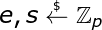
    1. Compute 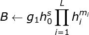
    1. Compute 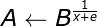
    1. Output signature 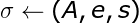
1. **Verification**
    1. Inputs 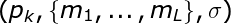
    1. Check 
1. **Zero-Knowledge Proof Generation**
    1. **AD** is the set of disclosed attributes
    1. **AH** is the set of hidden attributes
    1. Inputs 
    1. To create a signature proof of knowledge where certain messages are disclosed and others remain hidden
    1. Generate random numbers 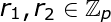
    1. Compute `B` as done in the signing phase
    1. Compute 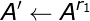
    1. Compute 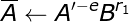
    1. Compute 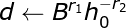
    1. Compute 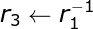
    1. Compute 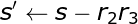
    1. Compute 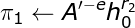
    1. Compute for all hidden attributes (for example m1 and m2) 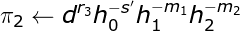
    1. Revealed attributes (m3 and m4)
1. **Zero-Knowledge Proof Verification**
    1. Check signature 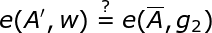
    1. Check hidden attributes 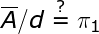
    1. Check revealed attributes 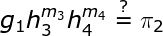

The BBS+ spec does not specify when the generators 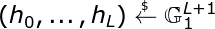),
only that they are random generators. Generally in cryptography, public keys are created entirely during the key generation step. However,
Notice the only value in the public key `pk` that is tied to the private key `x` is `w`. 
If we isolate this value as the public key `pk`, this is identical to the [BLS signature keys](https://crypto.stanford.edu/~dabo/pubs/papers/BLSmultisig.html) or ECDSA. 
The remaining values could be computed at a later time, say during signing, verification, proof generation and verification.
This means key generation and storage is much smaller at the expense of computing the generators when they are needed.
Creating the remaining generators in this manner will require that all parties are able to arrive at the same values
otherwise signatures and proofs will not validate. In this Spec, we describe an efficient and secure method for
computing the public key generators on-the-fly.

## Proposal

In a prime field, any non-zero element in a prime order group generates the whole group, and ability to solve the discrete log relatively to a specific generator is equivalent to ability to solve it for any other.
As long as the generators are valid elliptic curve points, then any point should be secure. To compute generators,
we propose using IETF's [Hash to Curve](https://datatracker.ietf.org/doc/draft-irtf-cfrg-hash-to-curve/?include_text=1) algorithm which is also constant time combined with known inputs.
This method allows any party to compute generators that can be used in the BBS+ signature scheme.

## Algorithm

Using these changes, the API changes to be identical to ECDSA and BLS except signing and verification can include any number of messages vs a single message.

The API's change in the following way and compute the message specific generators by doing the following

1. `H2C` is the hash to curve algorithm
1. I2OSP: Thise function is used to convert a byte string to a non-negative integer as described in [RFC8017](https://tools.ietf.org/html/rfc8017).
1. Compute 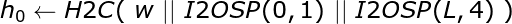
1. Compute 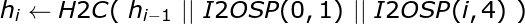

1. **Key Generation**
    1. Inputs 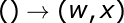
    1. Generate random 
    1. Compute 
    1. Secret key is `x` and public `pk` is `w`
    1. Output (`pk`, `x`)
1. **Signature**
    1. Inputs 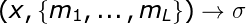
    1. Compute 
    1. Compute message specific generators.
    1. Same as before
1. **Verification**
    1. Inputs ![]
    1. Compute message specific generators.
    1. Verify as before
